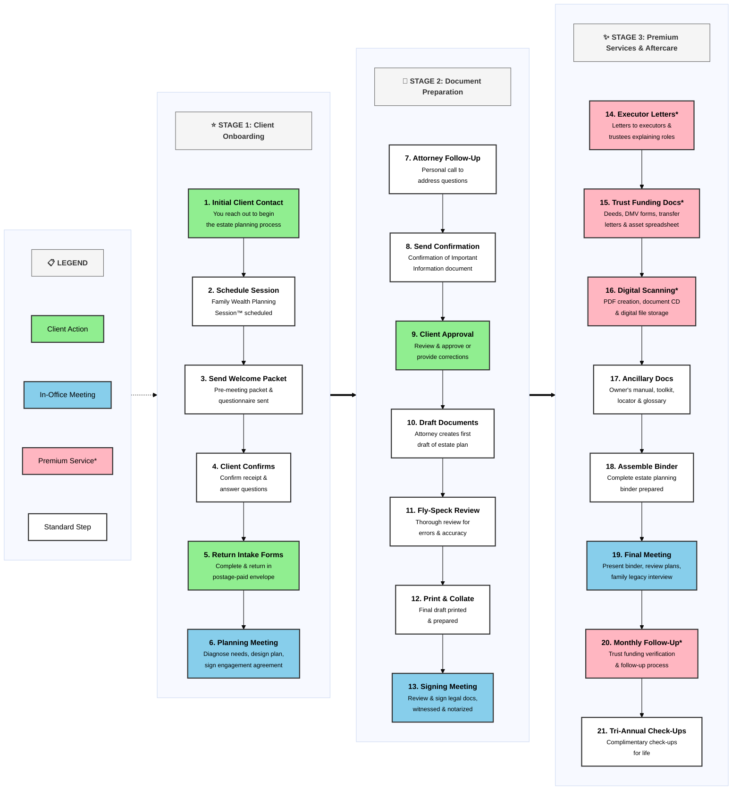

# Estate Planning Process Flowchart

**Process Driven**: State of the art technology drives our process, ensuring nothing falls through the cracks and that your plan will work, period!

## Legend
- 🟢 **Green**: Requires Client Action
- 🔵 **Blue**: Client Meeting At The Office
- 🔴 **Red**: Not Included In Lite Level Package

---

---

## How to Use This Flowchart

### In VS Code:
1. Right-click this file and select **"Open Preview"** to see the rendered flowchart
2. You can edit the text and see live updates in the preview

### For WordPress:
1. Install a Mermaid plugin like **"WP Mermaid"** or **"Embed Mermaid Charts"**
2. Copy the code between the \`\`\`mermaid tags
3. Paste it into your WordPress page/post using the Mermaid block or shortcode

### To Export as Image:
1. Use the preview to screenshot
2. Or use online tools like mermaid.live to export as SVG/PNG

---

## Notes for Customization
- Want to change colors? Modify the `classDef` lines at the top of the diagram
- Need to add/remove steps? Just add/remove boxes and connections
- Want different flow? We can adjust the connections between steps
